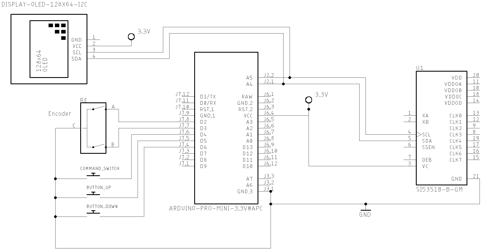
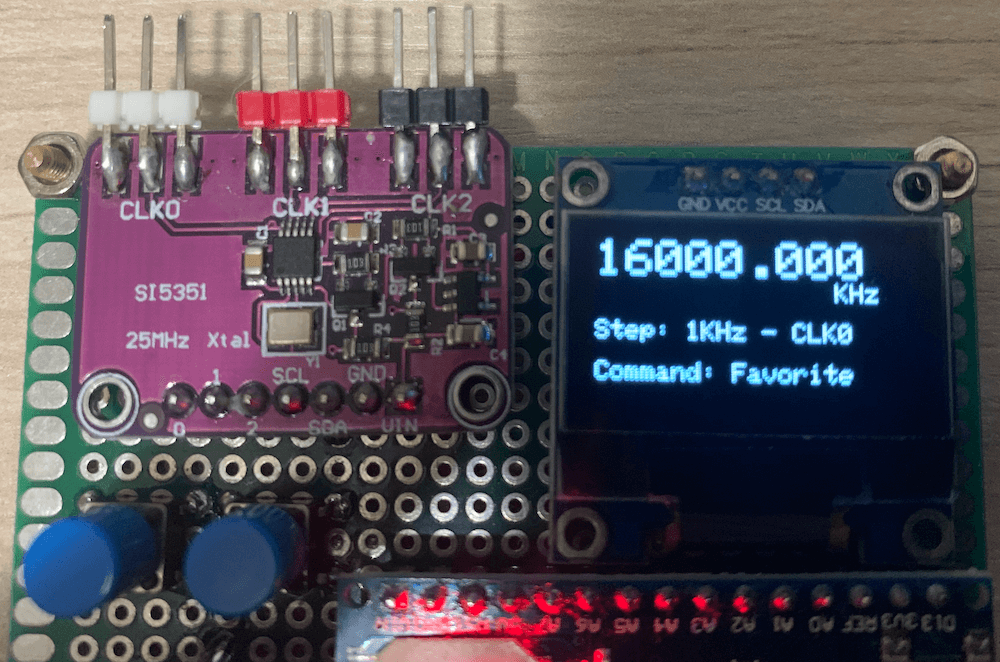

# [Multipurpose signal generator with SI5351](https://pu2clr.github.io/SI5351/)

It is a multipurpose signal generator controlled by Arduino. This project uses the SI5351 from Silicon Labs.
The [Arduino sketch](https://github.com/pu2clr/SI5351/tree/master/source) is configured to control the SI5351 with three channels from 32.768KHz to 160MHz and steps from 1Hz to 1MHz. 

This project can be freely distributed using the [MIT Free Software model](https://pu2clr.github.io/SI5351/#mit-license). 

[Copyright (c) 2020 Ricardo Lima Caratti](https://pu2clr.github.io/AKC695X/#mit-license). 

Contact: __pu2clr@gmail.com__.

Be a member of Facebook group [DSP receivers for hobbyists](https://www.facebook.com/groups/2655942598067211)

## Content

1. [Preface](https://pu2clr.github.io/SI5351/#preface)
2. [Schematic](https://pu2clr.github.io/SI5351/#schematic)
3. [Photos and Interface](https://pu2clr.github.io/SI5351/#photos-and-interface)
4. [Source Code](source)
5. [References](https://pu2clr.github.io/SI5351/#references)

## Preface

The Si5351 is an I2C configurable clock generator that is very appropriate for many electronic projects. It is also a great device for replacing crystal oscillators. This project uses a version of SI5351 that has three signal outputs that can vary from 8 KHz to 160 MHz. These outputs, can give you three distinct frequencies running at the same time. A great feature of the Si5351A is the possibility of using it with a microcontroller or platform like Arduino, PIC family and others. This small project is about a multipurpose signal generator controlled by Arduino or similar. For more information about SI5351A see [Si5351A/B/C-B  I2C-PROGRAMMABLE ANY-FREQUENCY CMOS CLOCKGENERATOR + VCXO](https://www.silabs.com/documents/public/data-sheets/Si5351-B.pdf). 

Despite the square wave form generated by the Si5351 device, it is very appropriated for many transmitters and receivers applications. This project has been very useful for me during Arduino Library development for the DSP receivers SI473X, SI4844, AKC695X, KT0915 and otehrs. With this signal generator, I could test the external oscillator feature of these devices. Also, I used it to build a small shortwave transmitter to test the HF reception during the bad propagation and bad reception conditions due to my current location. 

### See also:

1. [PU2CLR Si4735 Library for Arduino](https://pu2clr.github.io/SI4735/). This library was built based on “Si47XX PROGRAMMING GUIDE; AN332” and it has support to FM, AM and SSB modes (LW, MW and SW). It also can be used on all members of the SI47XX family respecting, of course, the features available for each IC version;
2. [PU2CLR SI4844 Arduino Library](https://github.com/pu2clr/SI4844). This is an Arduino library for the SI4844, BROADCAST ANALOG TUNING DIGITAL DISPLAY AM/FM/SW RADIO RECEIVER,  IC from Silicon Labs.  It is available on Arduino IDE. This library is intended to provide an easier interface for controlling the SI4844.
3. [PU2CLR AKC695X Arduino Library](https://pu2clr.github.io/AKC695X/). The AKC695X is a family of IC DSP receiver from AKC technology. The AKC6955 and AKC6959sx support AM and FM modes. On AM mode the AKC6955 and AKC6959sx work on LW, MW and SW. On FM mode they work from 64MHz to 222MHz.
4. [PU2CLR KT0915 Arduino Library](https://pu2clr.github.io/KT0915/). The KT0915 is a full band AM (LW, MW and SW) and FM DSP receiver that can provide you a easy way to build a high quality radio with low cost.
5. [PU2CLR RDA5807 Arduino Library](https://pu2clr.github.io/RDA5807/). The RDA5807 is a FM DSP integrated circuit receiver (50 to 115MHz) with low noise amplifier support. This device requires very few external components if compared with other similar devices. It also supports RDS/RBDS functionalities, direct auto gain control (AGC) and real time adaptive noise cancellation function.
6. [PU2CLR SI470X Arduino Library](https://pu2clr.github.io/SI470X/). It is a Silicon Labs device family that integrates the complete functionalities for FM receivers, including RDS (Si4703).
7. [Small Shortwave transmitter](https://github.com/pu2clr/Small-Shortwave-Transmitter). This project is about a shortwave trasmitter from 3 MHz to 30 MHz. It uses the SI5351 oscillator from Silicon Labs controlled by Arduino. Also, you can use it with a crystal oscillator. In this case, you will not need the SI5351 devive and Arduino.
8. [Simple BFO with si5351 controlled by Arduino](https://github.com/pu2clr/BFO). This small project is about a BFO that you can control the output of the Si5351A by using the Arduino Micro (Atmega32u4). This BFO ocilates from 452KHz to 458KHz. However, you can change this range for other between 8Kz to 160MHz. 
9. [VFO and BFO using Arduino with Si5351 controlled by SmartPhone](https://github.com/pu2clr/VFO_SI5351_ARDUINO_SMARTPHONE). This project implements a VFO and BFO using an Arduino with Si5351 signal generator. You can controll the VFO using an encoder and also a SmartPhone via a mobile application developed here for this purpose.

#### More Arduino Projects by author 

* [Multipurpose signal generator with SI5351](https://pu2clr.github.io/SI5351/). It is a multipurpose signal generator controlled by Arduino. This project uses the SI5351 from Silicon Labs. The Arduino sketch is configured to control the SI5351 with three channels from 32.768KHz to 160MHz and steps from 1Hz to 1MHz.
* [Shortwave Arduino Transmiter](https://pu2clr.github.io/Small-Shortwave-Transmitter/). This project is about a shortwave transmitter from 3 MHz to 30 MHz. It uses the SI5351 oscillator from Silicon Labs controlled by Arduino. Also, you can use it with a crystal oscillator. In this case, you will not need the SI5351 device and Arduino. 
* [Android and iOS Bluetooth Remote Control for PU2CLR Arduino Library DSP receivers](https://pu2clr.github.io/bluetooth_remote_control/). This project is an extension of the Arduino library projects for: [SI4735](https://pu2clr.github.io/SI4735/); [AKC6959](https://pu2clr.github.io/AKC695X/) and [KT0915](https://pu2clr.github.io/KT0915/). It is a simple example that shows a way to use your smartphone as a remote control via Bluetooth. In order to follow the steps presented here, I am assuming that you have some knowledge in development for mobile devices. Also, you will need to be familiar with the Javascript programming language. The development environment used by this project is the [Apache Cordova](https://cordova.apache.org/docs/en/latest/guide/overview/index.html). Cordova is a open-source mobile development framework that allows you to develop cross-platform applications. That means you can code once and deploy the application in many system, including iOS and Android. 
Cordova provides an easy way to develop for iOS and Android.  
* [Band Pass Filter controlled by Arduino](https://pu2clr.github.io/auto_bpf_arduino/). It is a HF band pass filter controlled by Arduino. It is designed for HF receivers. With this project, you can use a set of up to four HF bandpass filters that can be selected by Arduino. To do that you will need just two digital Arduino pins.

There is a __Facebook__ group called [__Si47XX for Radio Experimenters__](https://www.facebook.com/groups/532613604253401/) where the purpose is exchanging experiences with projects based on Silicon Labs  SI47XX IC family. You will be welcome to the group [Si47XX for Radio Experimenters](https://www.facebook.com/groups/532613604253401/). You can also be a member of __group.io__ [SI47XX for hobbyists](https://groups.io/g/si47xx)

## Arduino Source Code

   The Arduino sketch can be found on [source folder - https://github.com/pu2clr/SI5351/tree/master/source](https://github.com/pu2clr/SI5351/tree/master/source). The software is configured to control the SI5351 from 32.768KHz to 160MHz and steps from 1Hz to 1MHz.

   For SI5351 control, the Arduino sketch uses the [Etherkit/si5351 Arduino library from Jason Milldrum](https://github.com/etherkit/Si5351Arduino);

   For encoder control, the Arduino sketch uses the Rotary Encoder Class implementation from Ben Buxton (the source code is included together with this sketch)

   [See source folder for more detail](https://github.com/pu2clr/SI5351/tree/master/source). 

## Schematic

## Photos and Interface

The user interface of this generator consists of three push buttons and an encoder. One of that push buttons comes with the encoder device. 

Pressing the encoder push button, you can select the current control (Step, Favorite frequencies or output clock). By pressing de left or right push buttons, you can select the parameter you want for each kind of control. The display will show you the current status of the signal generator. 

The photos below show the multipurpose signal generator controlled by Arduino. This project uses an Arduino Nano. However, you can use any Arduino board. In this case, see the pinout of your Arduino.  

Current output clock is CLK0; the current Step is 10Hz; and current frequency is 8000.010 KHz 

The current control is output clock (select the output you want to setup by pressing the left or right push buttons); current clock is CLK2; current frequency is 32.768 KHz; and current step is 10 Hz.

The current frequency on output CLK2 is 28000 KHz (28MHz); the current control is Step (select the step you want by pressing left or right push buttons); in this case, the current step is 50 KHz.

The current control is Favorite (select the favorite frequency you want for the current channel by pressing the left or right push buttons); the current step is 1 KHz; and current frequency is 16MHz. 

## MIT License 

Copyright (c) 2019 Ricardo Lima Caratti

Permission is hereby granted, free of charge, to any person obtaining a copy of this software and associated documentation files (the "Software"), to deal in the Software without restriction, including without limitation the rights to use, copy, modify, merge, publish, distribute, sublicense, and/or sell copies of the Software, and to permit persons to whom the Software is furnished to do so, subject to the following conditions:

The above copyright notice and this permission notice shall be included in all copies or substantial portions of the Software.

THE SOFTWARE IS PROVIDED "AS IS", WITHOUT WARRANTY OF ANY KIND, EXPRESS OR IMPLIED, INCLUDING BUT NOT LIMITED TO THE ARRANTIES OF MERCHANTABILITY, FITNESS FOR A PARTICULAR PURPOSE AND NONINFRINGEMENT. IN NO EVENT SHALL THE AUTHORS OR COPYRIGHT HOLDERS BE LIABLE FOR ANY CLAIM, DAMAGES OR OTHER LIABILITY, WHETHER IN AN ACTION OF CONTRACT, TORT OR OTHERWISE, ARISING FROM, OUT OF OR IN CONNECTION WITH THE SOFTWARE OR THE USE OR OTHER DEALINGS IN THE SOFTWARE.

## References

* [Si5351A/B/C-B  I2C-PROGRAMMABLE ANY-FREQUENCY CMOS CLOCKGENERATOR + VCXO](https://www.silabs.com/documents/public/data-sheets/Si5351-B.pdf). 
* [Etherkit/si5351 Arduino library from Jason Milldrum](https://github.com/etherkit/Si5351Arduino)