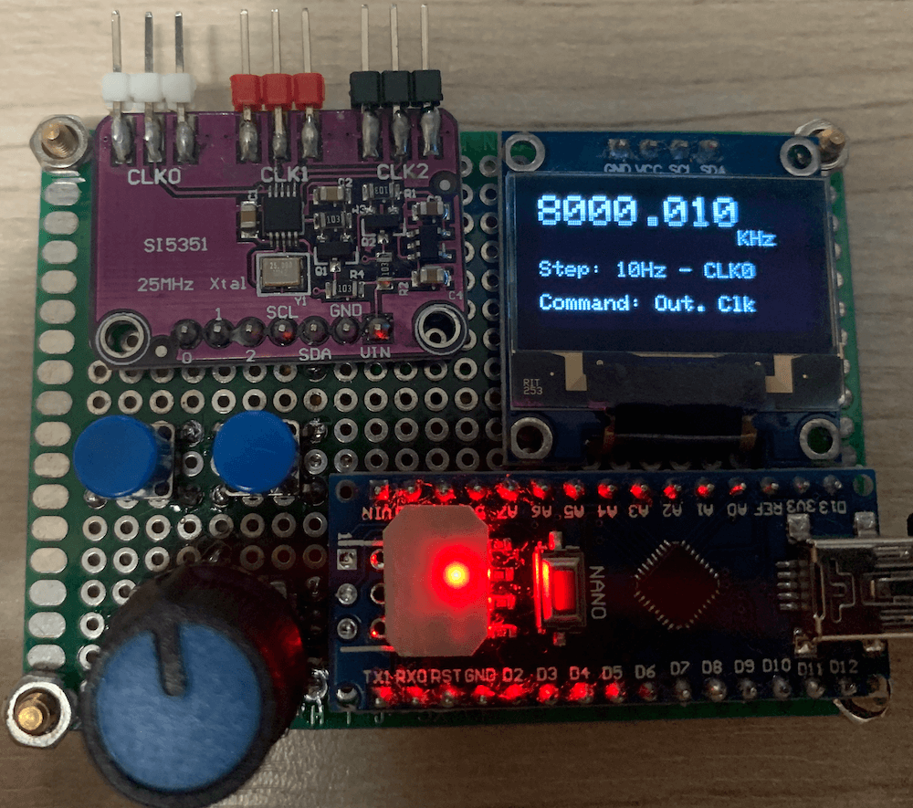
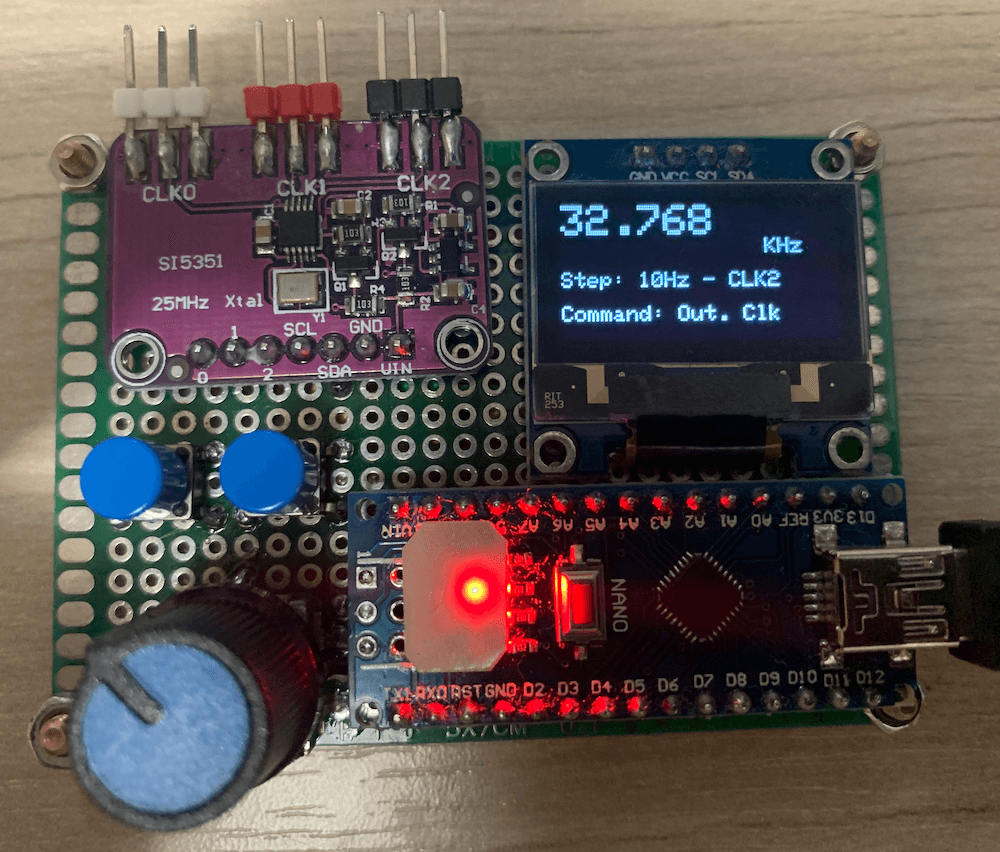
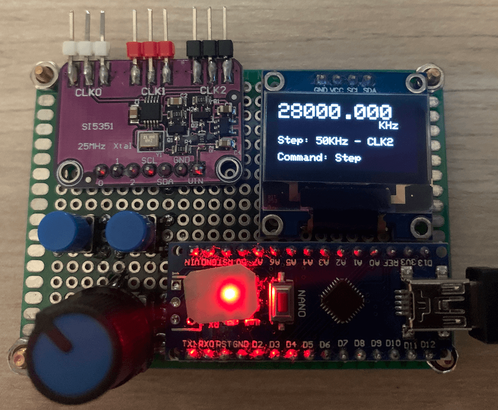

# Multipurpose signal generator with SI5351

It is a multipurpose signal generator controlled by Arduino. This project uses the SI5351 from Silicon Labs.
The [Arduino sketch](https://github.com/pu2clr/SI5351/tree/master/source) is configured to control the SI5351 from 32.768KHz to 160MHz and steps from 1Hz to 1MHz. 

This project can be freely distributed using the [MIT Free Software model](https://pu2clr.github.io/SI5351/#mit-license). 

[Copyright (c) 2020 Ricardo Lima Caratti](https://pu2clr.github.io/AKC695X/#mit-license). 

Contact: __pu2clr@gmail.com__.

## Preface

The Si5351 is an I2C configurable clock generator that is very appropriate for many electronic projects. It is also a great device for replacing crystal oscillators. This project uses a version of SI5351 that has three signal outputs that can vary from 8Hz to 160Mhz. These outputs, can give you three distinct frequencies running at the same time. A great feature of the Si5351A is the possibility of using it with a microcontroller or platform like Arduino, PIC family and others. This small project is about a multipurpose signal generator controlled by Arduino. For more information about SI5351A see [Si5351A/B/C-B  I2C-PROGRAMMABLE ANY-FREQUENCY CMOS CLOCKGENERATOR + VCXO](https://www.silabs.com/documents/public/data-sheets/Si5351-B.pdf). 

## Schematic

## MIT License 

Copyright (c) 2019 Ricardo Lima Caratti

Permission is hereby granted, free of charge, to any person obtaining a copy of this software and associated documentation files (the "Software"), to deal in the Software without restriction, including without limitation the rights to use, copy, modify, merge, publish, distribute, sublicense, and/or sell copies of the Software, and to permit persons to whom the Software is furnished to do so, subject to the following conditions:

The above copyright notice and this permission notice shall be included in all copies or substantial portions of the Software.

THE SOFTWARE IS PROVIDED "AS IS", WITHOUT WARRANTY OF ANY KIND, EXPRESS OR IMPLIED, INCLUDING BUT NOT LIMITED TO THE ARRANTIES OF MERCHANTABILITY, FITNESS FOR A PARTICULAR PURPOSE AND NONINFRINGEMENT. IN NO EVENT SHALL THE AUTHORS OR COPYRIGHT HOLDERS BE LIABLE FOR ANY CLAIM, DAMAGES OR OTHER LIABILITY, WHETHER IN AN ACTION OF CONTRACT, TORT OR OTHERWISE, ARISING FROM, OUT OF OR IN CONNECTION WITH THE SOFTWARE OR THE USE OR OTHER DEALINGS IN THE SOFTWARE.

## Photos 

The photos below show the multipurpose signal generator controlled by Arduino. This project uses an Arduino Nano. However, you can use any Arduino board. In this case, see the pinout of your Arduino.  

## References

[Si5351A/B/C-B  I2C-PROGRAMMABLE ANY-FREQUENCY CMOS CLOCKGENERATOR + VCXO](https://www.silabs.com/documents/public/data-sheets/Si5351-B.pdf). 
[Etherkit/si5351 Arduino library from Jason Milldrum](https://github.com/etherkit/Si5351Arduino)